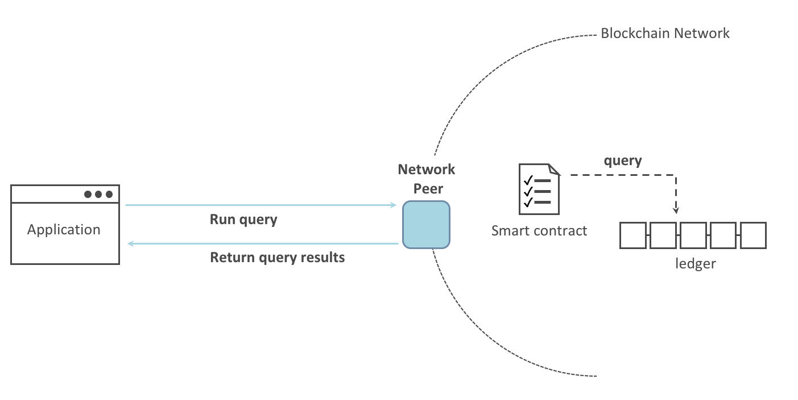

# 编写第一个应用

样例应用 `FabCar`

通过三个基本步骤来描述:

1. 设置开发环境。应用需要与网络交互，因此需要一个智能合约和应用与之交互基本网络。


2. 学习样例智能合约，FabCar。

3. 开发应用来使用FabCar。


## 建立区块链网络

清理已经启动的网络, 如：BYFN网络

```shell
./byfn.sh down
```

如果之前有运行过fabcar, 需要删除相关容器和镜像

```shell
docker rm -f $(docker ps -aq)
docker rmi -f $(docker images | grep fabcar | awk '{print $3}')
```

## 启动网络

进入`fabric-samples`仓库的`fabcar`目录

```shell
./startFabric.sh javascript
```

## 安装应用

```shell
cd javascript
npm install
```

>如果安装报权限问题, `npm install --unsafe-perm`

## 登记`admin`用户

```shell
node enrollAdmin.js
```

## 注册和登记`user1`

```shell
node registerUser.js
```

## 查询账本

```shell
node query.js
```





## FabCar 智能合约


## 更新账本

```shell
node invoke.js
```

```shell
node query.js
```


